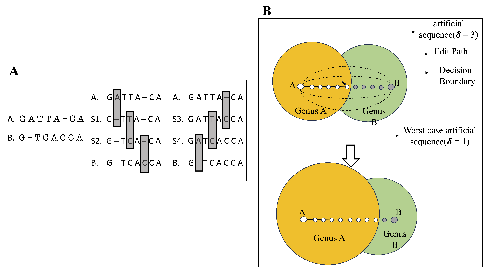

# Transitive Annotation
**Introduction:** A common task in the analysis of microbial communities involves assigning taxonomic labels to the sequences derived from organisms found in the communities. Frequently, such labels are assigned using machine learning algorithms that are trained to recognize individual taxonomic groups based on training data sets that comprise sequences with known taxonomic labels. Ideally, the training data should rely on labels that are experimentally verified—formal taxonomic labels require knowledge of physical and biochemical properties of organisms that cannot be directly inferred from sequence alone. However, the labels associated with sequences in biological databases are most commonly computational predictions which themselves may rely on computationally-generated data—a process commonly referred to as “transitive annotation.”

**Methods:** In this manuscript we explore the implications of training a machine learning classifier (the Ribosomal Database Project’s Bayesian classifier in our case) on data that itself has been computationally generated. We generate new training examples based on 16S rRNA data from a metagenomic experiment, and evaluate the extent to which the taxonomic labels predicted by the classifier change after re-training.

**Results:** We demonstrate that even a few computationally-generated training data points can significantly skew the output of the classifier to the point where entire regions of the taxonomic space can be disturbed.

**Discussion and conclusions:** We conclude with a discussion of key factors that affect the resilience of classifiers to transitively-annotated training data, and propose best practice to avoid the artifacts described in our paper.

In this repository we maintain the code used for generating artificial sequences obtained from sampling the edit paths between sequences that differ only at the genus level. 

<p align="center"> </p>

Our work has been puiblished in [frontiers in microbiology](https://www.frontiersin.org/journals/microbiology/articles/10.3389/fmicb.2023.1240957/full). Please cite our work, if you use it in your research. 
```
@article{muralidharan2024impact,
  title={The impact of transitive annotation on the training of taxonomic classifiers},
  author={Muralidharan, Harihara Subrahmaniam and Fox, Noam Y and Pop, Mihai},
  journal={Frontiers in Microbiology},
  volume={14},
  pages={1240957},
  year={2024},
  publisher={Frontiers}
}
```